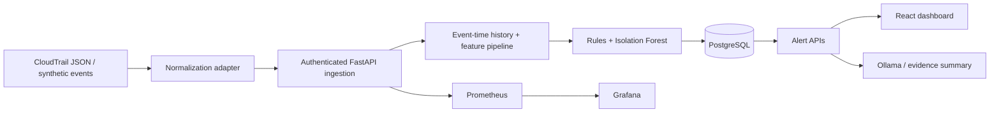

# CloudSentinel
### Cloud security detection with explainable rules and machine learning

A portfolio MVP that ingests normalized security events, correlates recent activity, ranks anomalies with Isolation Forest, stores findings in PostgreSQL, and presents an analyst dashboard. Optional Ollama summaries run locally; a clearly labeled evidence template works without an LLM.

**Status:** working local implementation. Synthetic ML baseline. AWS deployment assets included; no claim of production accuracy or completed AWS deployment.

## Architecture



## Run with Docker

Requirements: Docker with Compose. No AWS account or LLM is needed for the local demo.

1. Copy `.env.example` to `.env`.
2. Generate three separate random hexadecimal values (for example with `python -c "import secrets; print(secrets.token_hex(24))"`) and fill in API_KEY, POSTGRES_PASSWORD, and GRAFANA_PASSWORD.
3. Run `docker compose up --build -d`.
4. Open [the dashboard](http://localhost:8000) and enter your API_KEY.
5. Load the demo: `docker compose exec api python scripts/demo.py`. Click **Refresh events**.

The API container already receives API_KEY from Compose. Demo IDs are deterministic, so rerunning the demo does not create duplicates.

- [API documentation](http://localhost:8000/docs): authorize individual calls using the X-API-Key header.
- [Prometheus](http://localhost:9090)
- [Grafana](http://localhost:3000): username admin and your GRAFANA_PASSWORD; the Security folder contains the provisioned dashboard.

To stop services while retaining data: `docker compose down`.

### Optional LLM

Set LLM_ENABLED=true in .env, then:

```bash
docker compose --profile llm up -d
docker compose exec ollama ollama pull llama3.2
docker compose up -d api
```

Select an alert and click **Summarize incident**. The response identifies whether it came from the LLM, the template, or a fallback after an LLM failure. Model downloads need internet access and sufficient memory. LLM output requires analyst review.

## Detection coverage

| Signal | Implementation | Caveat |
|---|---|---|
| Unusual login time | Console login before 06:00 or after 22:00 UTC | Global heuristic, not per-user baseline |
| Failed authentication | Five failures per principal within ten minutes | ConsoleLogin only |
| Sensitive IAM changes | Successful policy, trust, or key changes | Indicates an action to investigate, not proof of escalation |
| API volume | Thirty events per principal within one minute | Fixed threshold |
| Data access | At least 100 MB in the normalized event | CloudTrail adapter does not infer byte counts |
| Impossible travel | Over 500 km and 900 km/h between successful logins | Requires caller-supplied trusted coordinates; VPNs cause false positives |
| ML anomaly | Isolation Forest on cyclic UTC hour, log bytes, and failure flag | Synthetic training data; no validated production accuracy |

Threat technique IDs are analyst hints. Several IAM actions map broadly to Account Manipulation; action-specific subtechniques and policy interpretation are future work. ML anomalies and volume spikes intentionally have no automatic technique attribution.

The anomaly score is a bounded ranking transformation of Isolation Forest's decision function. It is **not a probability**. Rule severity is separate. The model is trained deterministically at startup from synthetic normal behavior, never from incoming events. See [model card](docs/MODEL_CARD.md).

## Ingest your own events

```bash
curl http://localhost:8000/api/events \
  -H "X-API-Key: YOUR_KEY" -H "Content-Type: application/json" \
  -d '{"events":[{"event_id":"example-1","timestamp":"2026-01-15T02:30:00Z","principal":"demo-user","action":"AttachUserPolicy","success":true}]}'
```

All timestamps must include a timezone. Coordinates must be supplied together. Batches contain 1–500 events. Duplicate event IDs are skipped. Do not reuse an ID for different data.

For exported CloudTrail JSON containing a Records array, set API_KEY and optionally API_URL in your terminal, then run `python scripts/cloudtrail.py exported-logs.json`. The adapter handles ConsoleLogin failure responses and AWS error codes. It does not configure a live CloudTrail subscription, download logs, infer geography, or enrich bytes transferred.

Batches are sorted by event time; lookbacks use up to 5,000 earlier events for the same principal over 24 hours. Late events do not retroactively recompute prior findings. PostgreSQL transaction locks serialize ingestion across workers. SQLite development supports one API worker only.

## Develop and test

Python 3.12 and Node 22+ with pnpm 11.19.0:

```bash
python -m venv .venv
# Activate .venv using your shell's activation command.
pip install -r requirements.txt
pytest -q
# Set API_KEY to at least 16 random characters in your shell.
uvicorn app.main:app --reload
```

In a second terminal:

```bash
cd frontend
pnpm install --frozen-lockfile
pnpm dev
```

Vite proxies /api to port 8000. `pnpm build` places the dashboard in app/static, which FastAPI serves. SQLite is the development default; Compose uses PostgreSQL. Set DATABASE_URL to choose another database.

GitHub Actions runs SQLite and PostgreSQL tests and builds the full Docker image. The tests cover auth, schema validation, idempotency, ordered batch history, detection rules, CloudTrail failures, and model determinism.

## AWS and GitHub

See [AWS deployment runbook](docs/AWS.md) and [ECS task definition](infra/task-definition.json). Supply your AWS resources and secret ARNs before deployment.

To publish this folder as a new GitHub repository, run from its root:

```bash
git init -b main
git add .
git commit -m "Build CloudSentinel security detection MVP"
gh repo create cloudsentinel --public --source=. --remote=origin --push
```

Review the repository contents and choose private visibility if desired. Never commit .env or real security logs.

## Limits and next milestones

This is a single-tenant portfolio MVP with a shared API key. It is not a production SOC platform. Metrics have no application authentication and must remain on an internal network. The Docker bindings are localhost-only. Ingestion is synchronous and serialized; retention and database migrations are not implemented.

Next: measured evaluation on approved representative data, per-identity baselines, drift alerts, live S3/SQS ingestion, OIDC/RBAC, Alembic migrations, then Terraform for repeatable AWS provisioning.

A defensible resume description after running it yourself:

> Built a cloud-security detection MVP with FastAPI, PostgreSQL, React, and Isolation Forest, combining explainable rules, authenticated ingestion APIs, optional local LLM summaries, Docker packaging, and automated tests.

Add AWS deployment and measured results only after completing and validating them.

MIT licensed.
